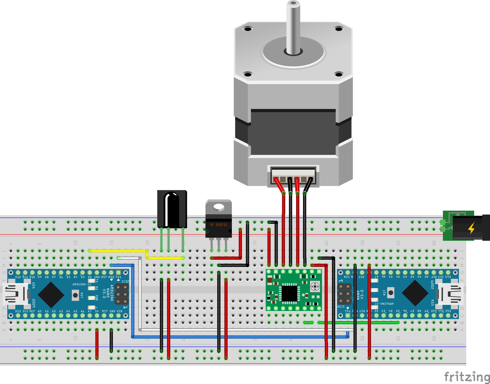
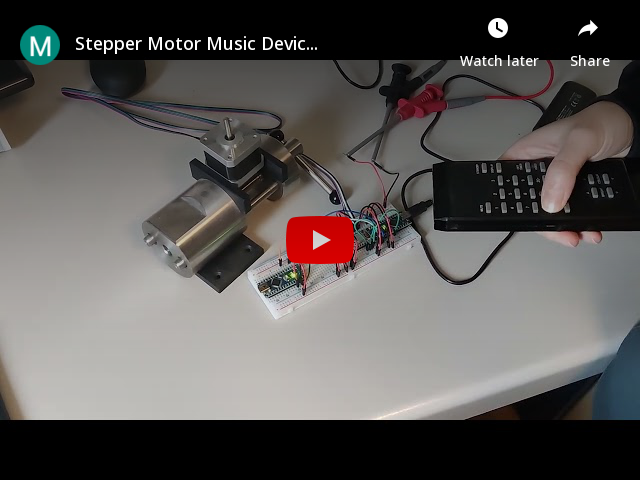

# Stepper Motor Music Device With Remote Control 
In this project, I use two Arduino Nano Micro-controllers, one of which is supposed to receive the infrared signal from the TV-remote and send a corresponding command based on the received signal to the second microcontroller via serial communication. Afterward, the second Arduino will send a signal to a stepper motor driver so that it plays a sound with a particular frequency.

## Requirements
### Hardware requirements
[1x TL1838 infrared receiver](hardware/TL1838.png), [TV remote control](hardware/IRremote.png), [2x Arduino Nano](hardware/arduinoNano.png), [1x A4988 stepper motor driver](hardware/A4988.png), [1x generic stepper motor](hardware/stepperMotor.png), jumper wires, 1x breadboard.

### Software requirements
Visual Studio Code with PlatformIO (suggested) or Arduino IDE.

### Other requirements
knowledge about IR-remotes, asynchronous serial communication, PWM, C/C++ programming, the GPIO Pins of micro-controllers.

## Hardware Setup

 

The connections between the components are shown above. The infrared signal is received and demodulated by the TL1838. The demodulated signal is fed into the first Arduino via standard IO pins (yellow wire). The Arduino on the left side is responsible for decoding the demodulated signal, which is achieved by using an IR remote library. After decoding, a command is sent to the second Arduino via serial communication (white and blue wire). It is important that Tx and Rx are connected to the opposite pin on the other microcontroller.

The Arduino on the right side is responsible for generating a certain signal depending on the received instruction. This is done with the tone() function. This function generates a PWM signal with 50% duty cycle and variable frequency. This signal is sent via standard IO pins (green wire). The stepper motor is driven forward by the stepper motor driver every time a rising edge is detected. The frequencies used are not randomly selected. Twelve keys on the remote control are assigned to the corresponding keys of an octave of piano notes.

## Demo

